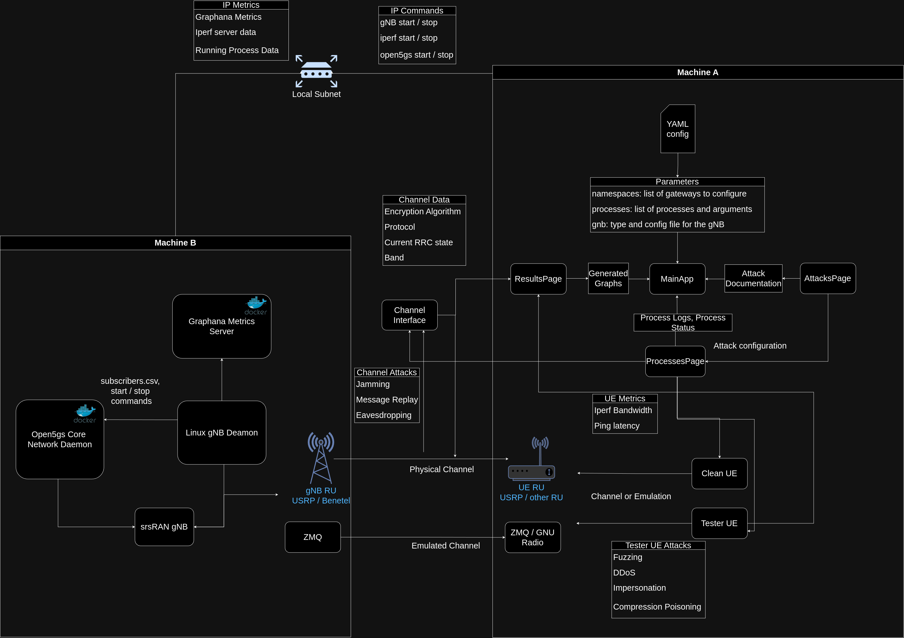

.. Soft-Tester UE documentation master file, created by
   sphinx-quickstart on Thu Sep 12 16:04:18 2024.
   You can adapt this file completely to your liking, but it should at least
   contain the root `toctree` directive.

NTIA Software Tester UE
==========================

Penetration testing tool for Software Defined Radio

Overview
--------

This project is a security testing tool based on srsRAN Project's User Equipment, used to test 5G and open radio access networks (RANs) via the Uu air interface between the UE and the network. While this enables different types of testing, the focus of the software is on RAN security testing. This soft T-UE is fully software-defined and compatible with widely available, commercial off-the-shelf software radio hardware. Standardized 3GPP or O-RAN tests as well as custom test procedures can then be implemented and executed at minimal cost and at different stages of RAN development and integration. This system allows for testing many commercial and open source random access networks with minimal technical overhead. Many attacks on the RAN can be run automatically by the system.

- :doc:`UE Documentation <rstFiles/UE>`
- :doc:`gNB Documentation <rstFiles/gNB>`

.. note:: 

    Soft-Tester UE is designed to run on Ubuntu and is tested on Ubuntu 24.04.

Build Tools and Dependencies
----------------------------

The Soft-Tester UE system has the following necessary dpendencies. Please install them beforehand.

    - `Docker <https://docs.docker.com/engine/install/ubuntu/>`_
    - `pip <https://pip.pypa.io/en/stable/installation/>`_
    - `venv <https://pypi.org/project/virtualenv/>`_
    - `UHD <https://files.ettus.com/manual/page_build_guide.html>`_ (build from sources recommended)

Installation
############

UE side (Machine A)
-------------------

Clone Soft-Tester UE repository:

.. code-block:: bash

   git clone https://github.com/oran-testing/soft-t-ue && git submodule update --init --recursive

To build the UE controller and webGUI, run:

.. code-block:: bash

   cd soft-t-ue/docker
   sudo docker compose build controller webui  --no-cache

gNB side (Machine B)
--------------------

Clone Soft-Tester UE repository and srsRAN_Project separately:

.. code-block:: bash

   git clone https://github.com/oran-testing/soft-t-ue && git submodule update --init --recursive
   git clone https://github.com/srsran/srsRAN_Project

.. note:: 

    Please refer to the official installation guide for `srsRAN_Project <https://docs.srsran.com/projects/project/en/latest/user_manuals/source/installation.html>`_

Install dockerized Open5GS:

.. code-block:: bash

   cd srsRAN_Project/docker
   sudo systemctl restart docker
   sudo docker compose build 5gc

Running
#######

.. warning::
    Always begin the experiment with UE first, otherwise, the connection will fail.

UE side (Machine A):
-------------------

To run the UE with controller and webGUI:
.. code-block:: bash

   cd soft-t-ue/docker
   sudo docker compose up controller webui

To see the metrics, open `http://localhost:3000/` in the browser.

gNB side (Machine B):
--------------------

To run the Open5GS:

.. code-block:: bash

   cd srsRAN_Project/docker
   sudo docker compose up 5gc

To run the gNB:

.. code-block:: bash

   sudo gnb -c ./soft-t-ue/configs/zmq/gnb_zmq_docker.yaml

.. note:: 

   If running with docker compose,use gnb_zmq_docker.yaml, otherwise, use gnb_zmq.yaml.

Optionally, the gNB can also be directly started with:

.. code-block:: bash

   sudo gnb -c ./soft-t-ue/configs/uhd/gnb_uhd.yaml

Once the connection establishes, you can check the webGUI localhost interface to collect the logs.

System Architecture
--------------------

.. toctree::
   :maxdepth: 1
   :caption: General

   UE Documentation <rstFiles/UE>
   gNB Documentation <rstFiles/gNB>
   Installation guide <rstFiles/installation>
   Message Types <rstFiles/messageTypes>
   IP Routing <rstFiles/ipRouting>
   Multi-UE Emulation <rstFiles/multiUE>
   
.. toctree::
   :maxdepth: 1
   :caption: Attacks implemented

   attacks/cqi_manipulation.rst
   attacks/gnb_impersonation_attack.rst
   attacks/imsi_capture.rst
   attacks/preamble_collision.rst
   attacks/rach_jamming.rst
   attacks/rach_replay.rst
   attacks/rach_signal_flooding.rst
   RoHC Poisoning Attack <attacks/rohc_poisoning_attack>
   attacks/signal_storming.rst
   attacks/pdcpParrot.rst
   RRC Release Request Spoofing <attacks/request_spoofing>
   attacks/sdu_fuzzing.rst
